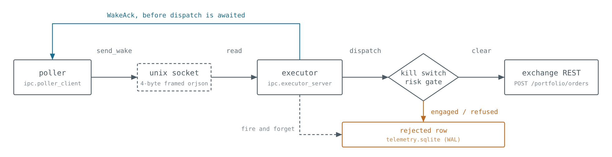

# prediction-market-infra


Trading infrastructure for [Kalshi](https://kalshi.com) and [Polymarket US](https://polymarket.us)
prediction markets: a two-process hot path over a Unix domain socket, and the cross-venue matcher
built to decide whether two markets on different exchanges are the same tradeable claim.

Everything here is runnable and checkable. The two benchmarks generate their own data, need no
credentials and no network, and print what they measured.

```bash
uv sync
uv run pytest                              # 391 tests, none of which may touch a live API
uv run python benchmarks/latency_bench.py  # signing + poller→executor round trip, asyncio vs uvloop
cd benchmarks && uv run python matcher_bench.py   # the narrowing, on a generated corpus
```

> Scope. This is an extraction from a larger private system, published so that its engineering
> claims can be checked by someone who does not have that system. The pricing layer, the live
> experiments, and the venue-facing research notes are not here and are not coming. Docstrings
> occasionally reference modules that were not extracted, and those references are left as written.
> [`docs/GUIDE.md`](docs/GUIDE.md) §7.1 lists what is in and what is out.

---

## 1. The hot path and benchmark

Two processes. The poller decides what to fire on. The executor owns how the order goes out, so
contract count, time in force, and self-trade prevention are all executor configuration. The split
exists so unbounded decision work never contends with the event loop that submits an order.

<p align="center">
  <picture>
    <source media="(prefers-color-scheme: dark)" srcset="docs/diagrams/hot-path-dark.png">
    
  </picture>
</p>

<p align="center"><sub>Every refusal writes a row. A halted system's inaction lands in the audit
trail.</sub></p>

Four decisions in there.

Wakes are deliberately lossy. A full queue drops the message and the poller keeps going, because a
stale fire is worse than a late one.

The wake carries its clock domain. Both processes are bound to one host, and monotonic timestamps
are comparable only within one machine and one boot. On a domain mismatch the executor records no
timing at all and still places the order.

Telemetry is never awaited before an order. `record_*` is `put_nowait` and return, drained by one
background writer thread per process. Nothing that can raise, block, or log for a telemetry reason
sits between building an order and sending it.

Every refusal writes a row. A kill-switched or risk-refused fire leaves a `rejected` row, so a
halted system's inaction is in the audit trail. That was not always true, and
[§6](docs/GUIDE.md#6-failure-modes-this-project-actually-hit) records the order that was placed,
filled completely, and left no row of any kind.

### What the benchmark measures, and what it does not

`benchmarks/latency_bench.py` measures the two hot-path contributors that can be exercised without a
live network call: RSA-PSS signing against an ephemeral, never-registered keypair generated for that
run, and a real poller → real Unix socket → real executor → real dispatcher round trip against a
fake venue client. It runs the round trip under stock `asyncio` and under `uvloop`, which is how the
`uvloop` decision was made, and appends to [`benchmarks/history.csv`](benchmarks/history.csv).

`--executor cpp:/path/to/executor_hotpath` puts the C++ reimplementation in
[executor-hotpath-cpp](https://github.com/anaborne/executor-hotpath-cpp) on the far end of the
socket instead. The poller, the frames and the `latency_events` table are the same, and
`poller_client.py` is not modified or subclassed to make it work, which is the whole claim the
substitution makes. The `executor` column in `history.csv` says which one produced a row.

Both configurations were run on one machine on 2026-08-30 and are the last two rows here.
Executor-side `wake_recv` fell by a factor of 2.4 to 5.2 depending on the event loop and the
percentile. The C++ repository's
[`RESULTS.md`](https://github.com/anaborne/executor-hotpath-cpp/blob/main/RESULTS.md) carries the
tables, the pre-registered expectation the run contradicted, and the confound that makes every
one of those ratios an upper bound: the Python baseline runs the poller and the executor on one
event loop, and the cpp configuration spawns a second process.

One run on the machine this was extracted on, from before 2026-08-30. The script ran 300 wake
iterations then and discarded no warm-up; both defaults moved that day, to 2000 and 200, so a run
today reports over a different sample:

```
platform: Linux-aarch64-py3.12.13

sign()                    p50=0.331ms  p99=0.499ms  n=2000   target <3.0ms   [OK]
wake_send (asyncio)       p50=1.042ms  p99=1.352ms  n=300    target <1.0ms   [OVER BUDGET]
wake_send (uvloop)        p50=0.675ms  p99=0.725ms  n=300    target <1.0ms   [OK]
wake_recv (uvloop)        p50=0.004ms  p99=0.011ms  n=300    target <1.0ms   [OK]

uvloop vs stock asyncio, p99: wake_send +46.4%, wake_recv +23.5%
Partial detect→fire p99 estimate (uvloop): 1.235ms
```

Latency is a property of the machine that runs the code, so every history row carries a platform
tag and your numbers will differ from these.

Three caveats on the reported figure.

- It is labelled partial, in the script's own docstring, and it excludes order construction, the
  real network call, and the telemetry write. A fabricated end-to-end number would misrepresent
  reality worse than publishing none.
- The parent system's end-to-end figure is not reproducible here, because it needs a signed round
  trip to a live demo account. Over the system's whole life it measured detect→fire p50 10.23ms /
  p90 29.66ms / p99 46.61ms on n=734 real demo-venue order fires, against a <15ms budget: met at
  the median, missed by roughly 3× at the tail. Shadow fires (the same path, real signature, stopped
  before the socket write) ran p50 6.72ms / p99 13.49ms on n=92,441. An earlier window (2026-08-21,
  n=139) read p50 4.33ms / p99 10.53ms and was quoted here until 2026-08-29; the lifetime figure
  replaces it because the window was favourable, and the small-sample number had hardened into a
  fact by being cited. The per-stage percentiles are committed as
  [`benchmarks/parent_latency_summary.csv`](benchmarks/parent_latency_summary.csv); the span is a
  lower bound, since the clock starts after `orjson.loads()` and stops when the request reaches
  `aiohttp`, so network transit and exchange-side processing sit outside it. Details in
  [§7.2](docs/GUIDE.md#72-the-process-model).
- It is one span. The gaps between stages are most of the elapsed time on a healthy run, and summing
  sub-measurements would make them disappear.

CI runs both benchmarks on every push to `main` and on every pull request, and asserts only that
they complete. A hosted runner is a noisy shared machine, and any latency threshold enforced there
would be either so loose it asserts nothing or so tight it fails on a busy neighbour.

---

## 2. Narrowing a billion pairs, and then refusing almost all of them

A full cross of two prediction-market venues is around a billion pairs, nearly all of them absurd
on their face. `crossvenue/matching.py` prices the whole cross in three stages that answer
different questions.

**Candidate generation** asks which markets could possibly be about this. Every market's tokens are
weighted by inverse document frequency, and only its six rarest tokens seed a lookup into an
inverted token→market index. `"spanberger"` is nearly conclusive, `"bitcoin"` is not, and IDF is
what tells them apart. A token appearing in more than 8% of the corpus is dropped from the index
outright, because a token in half the markets retrieves half the corpus and narrows nothing.

**Scoring** asks how alike they are, as a weighted blend of lexical overlap, entity agreement, and
time proximity. It is fuzzy on purpose and is never sufficient on its own. In the parent project's
first live scan, every genuinely correct proposition match scored around 0.52 on lexical overlap
alone, below the gate, because a decisive proper noun gets diluted among shared boilerplate.

**The settlement gate** asks whether two markets would pay out identically, and it is not fuzzy at
all. It compares structured facts (comparator and threshold, units, scheduled event time, resolution
source), and any check that fails or cannot be performed becomes a blocker. Missing data is a
blocker, because "no stated settlement source" is precisely the case where two venues quietly settle
on different numbers. A blocked pair can be `STRONG`, worth a human read, but never `IDENTICAL`, and
only `IDENTICAL` may carry a claimed arbitrage.

### The benchmark

`benchmarks/matcher_bench.py` runs the matcher over a corpus generated by
[`synthetic_corpus.py`](benchmarks/synthetic_corpus.py), reproducible from a seed, with a Zipf-like
token distribution so the index has real work to do, and with a known number of true pairs planted,
worded as each venue would word them. The plant is what makes a low match count readable. A matcher
that finds none of them is broken, and without the plant that is indistinguishable from a matcher
that is merely strict.

```
corpus:   synthetic, seed=20260825

  Kalshi-side markets              20,000
  counterparty markets              6,000
  full cross (pairs)          120,000,000
  tokens indexed                      531
  tokens dropped (too common)          25
  candidates scored               159,635
  reduction factor                    752x

  cleared the score gate              924

  Verdicts on the candidates that cleared it:
    identical           250
    strong                0
    weak                258
    rejected            416

  planted pairs                       250
  planted pairs recovered             250
  identical, not planted                0  (expected 0)
```

Every count above is the same on any machine and in any process. The run also prints a
platform line and a wall time, which are the host's and are left out of this block.

Filler markets are drawn from disjoint per-venue vocabularies, so the generator cannot emit an
identical pair nobody planted. That is what turns the last line into an assertion. Any unplanted
`IDENTICAL` is a defect.

These numbers are properties of the generator, and of no exchange. The production scan they mirror
in shape (95,206 × 10,656 markets, about 1.01 billion pairs, narrowed to 63,424 scored candidates
in 113 seconds) read two live venues whose listings are not in this repository and cannot be
reproduced from it. [§4.2](docs/GUIDE.md#42-cross-venue-arbitrage-kalshi--polymarket-us-does-not-exist)
records it.

### The case the gate initially missed

That production scan returned 0 verified arbitrage pairs, matching the fee arithmetic that
predicted none. Eighteen apparent edges worth up to 63¢ a contract were matching artifacts the gate
caught.

An earlier scan passed 33 pairs as `IDENTICAL`, and all 33 were Korean KBO or Japanese NPB baseball.
Both leagues end a regular-season game in a tie once extra innings are exhausted, and Kalshi words
each side as "if {team} wins, resolves Yes", so a tie resolves NO on both legs and the "hedge" pays
zero twice. Neither venue writes the word "draw" anywhere in a baseball game's rules, so no
wording-based check could have seen it. Whether a competition can draw is a fact about the sport.
The fix is an explicitly known-incomplete allowlist, kept as one because being wrong in that
direction costs a missed match and being wrong in the other costs the position.

---

## 3. What was found, and the record of getting it wrong

Most of the parent project is a record of things that did not work, measured carefully enough to be
sure. That is the finding. Every search is pre-registered, with criterion, sample size, stopping
rule and analysis order fixed in writing before any data, one declared extension, no interim looks,
and every closed one has returned negative.

- Cross-venue arbitrage: measured. Does not exist at taker/taker fees.
- Structural arbitrage within one venue: exactly zero inconsistencies across 100,859 markets, and a
  later pass closed that search's two stated blind spots at zero as well.
- Parlay coherence: 0 of 1,220 parlays priced cheaper than the independence product, over 1,177,933
  swept to exhaustion. Real, uniformly signed, and in the direction a retail account cannot sell.
- A directional crypto strategy: falsified out of sample, and left falsified.
- Calibration: a real ±4-6 point tilt through the middle of a contract's life, and every band of it
  net-negative after fees, with the two most extreme cells missing break-even by 0.02¢ and 0.10¢.

The recurring result has one shape. The taker fee is larger than the dislocations the market makes:
`0.07 × p(1−p)` is 1.75¢ at mid, against a measured gross cross-venue dislocation of 0-1¢. That
kills every fee-paying strategy built from public data before it is coded. One finding, arrived at
five separate ways.

[`docs/GUIDE.md`](docs/GUIDE.md) §4 has each with its sample size, §5 has the method, and §6 has
sixteen failure modes, each named as a general form and then as the instance that produced it. A
sample:

- A green test suite is blind to wire-shape truth. A suite that had grown to 604 tests stayed green
  through three separate wire-shape bugs, one of which sent `1 − yes_bid` to the wire.
- A counter with no decrement is a leak, and the first fix for it was also wrong. It replaced an
  unbounded error with a bounded guess where it should have replaced a guess with a fact.
- A structural guarantee written only in prose decays silently. One documented invariant was not in
  the code at all for an unknown period.
- Re-running a test that fails a third of the time is a coin flip that eventually comes up green,
  which is indistinguishable from having fixed it.

### The position-cap postmortem

A position cap latched shut and rejected 4,233 valid orders over 23 hours against zero open
positions, because a counter had no decrement. The first fix shipped and was still wrong. The
second read live exchange positions off a poll that was already running for another consumer, at
the cost of no new API calls and one documented net-versus-gross tradeoff.

[docs/incidents/2026-08-22-fill-ledger.md](docs/incidents/2026-08-22-fill-ledger.md) has the root
cause read out of the source, both fixes, the validation, and the one false alarm that came out of
the same debugging pass and is kept in the record.

---

## 4. Orchestrating the benchmark pipeline

The two benchmarks above (latency, matcher) used to run as two independent shell steps in CI, with
no retry and no persisted history for the matcher run. `benchmarks/orchestration/benchmark_flow.py`
wraps both in a small [Prefect](https://www.prefect.io) flow: two tasks with independent retry
policies (transient failures get one retry with backoff before the run is marked failed), structured
per-task logging, and a matcher-history log (`benchmarks/matcher_history.csv`) that closes a real
gap, since `latency_bench.py` already self-logged to `history.csv` and `matcher_bench.py` never did.

```bash
uv run python benchmarks/orchestration/benchmark_flow.py
```

runs both benchmarks once, end to end, against a local Prefect server that starts and stops
automatically, so no separate Prefect deployment is needed to reproduce a run. A scheduled
deployment (nightly, defined but not started by default, since this repo has no always-on host to
run it on) is defined at the bottom of the same file:

```bash
uv run python benchmarks/orchestration/benchmark_flow.py --serve
```

## Safety posture

No order has ever been sent to a real-money market by the parent system. Both trading processes
hard-refuse to start unless `KALSHI_ENVIRONMENT=demo`, and any order path must separately clear a
`KALSHI_ALLOW_PRODUCTION_ORDERS` gate that is off. The research package holds no signer and no key
material by construction, enforced by a test asserting the write-capable packages are absent from
its import graph (`tests/test_import_graph.py`). `OrderDispatcher` cannot be constructed at all
without a permission guard, because the callable is required and defaultless, so the rule is checked
by the type checker.

This repository needs no account and no credentials. Both benchmarks and the entire test suite run
offline.

## Gates

CI runs exactly these on every push to `main` and on every pull request, plus a smoke run of both
benchmarks and of the Prefect flow that wraps them:

```bash
uv run ruff check . && uv run ruff format --check .
uv run mypy                              # strict
uv run pytest -q                         # 391 tests, no network
```

## Documentation

- [docs/GUIDE.md](docs/GUIDE.md), architecture (§7), method (§5), failure modes (§6), results (§4). All measured numbers live here.
- [ENGINEERING.md](ENGINEERING.md), the standards this code is held to, and why each exists
- [docs/incidents/](docs/incidents/), postmortems
- [docs/configuration.md](docs/configuration.md), every environment variable

## License

MIT, per [`LICENSE`](LICENSE).
